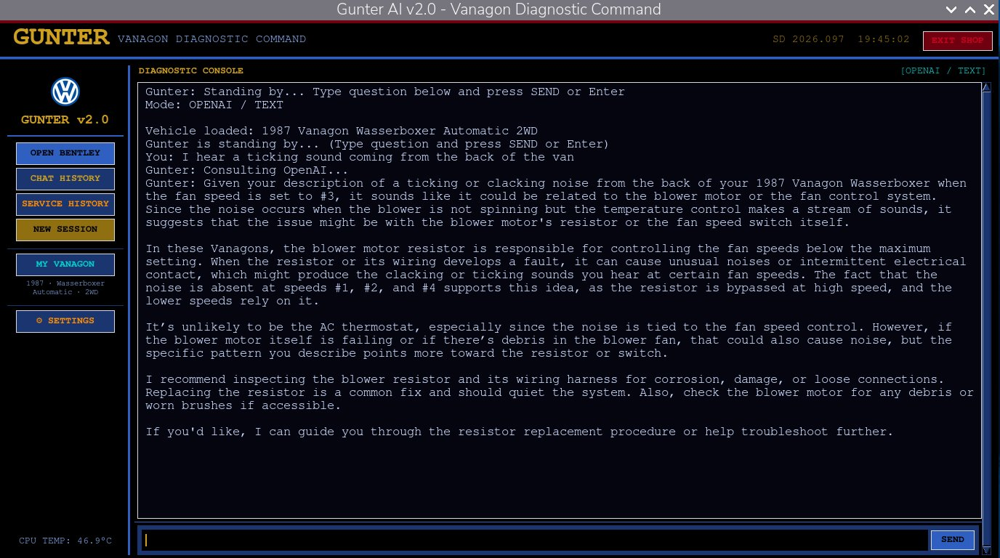
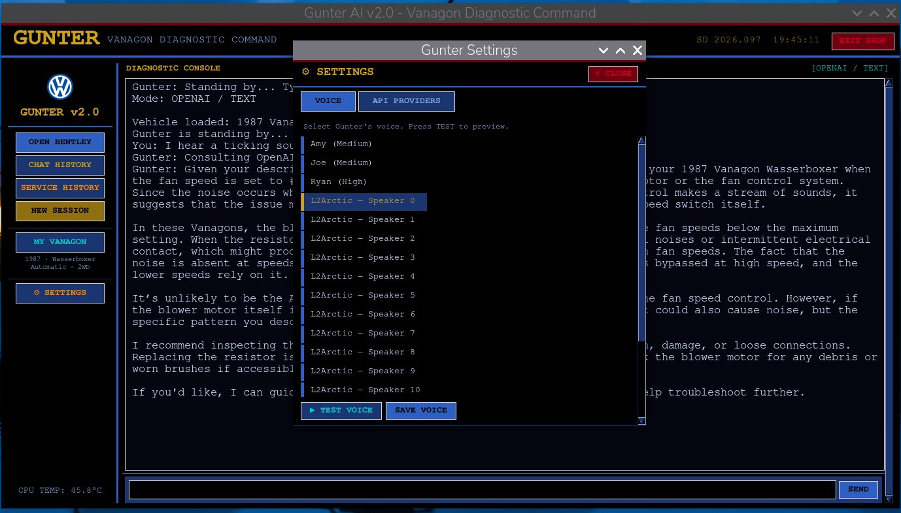
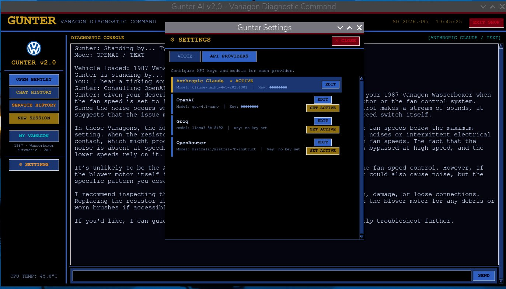
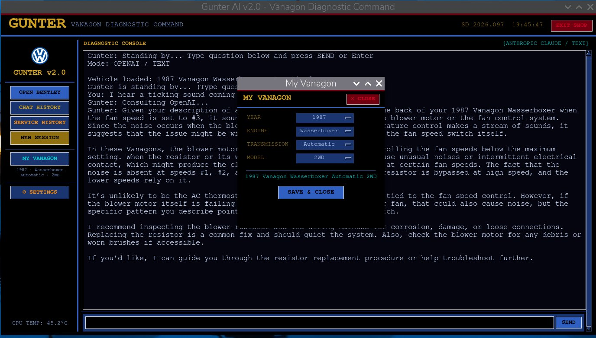
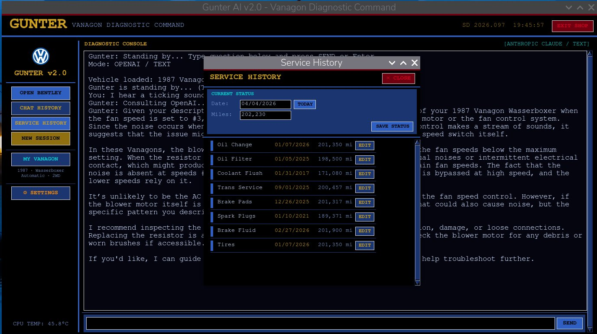
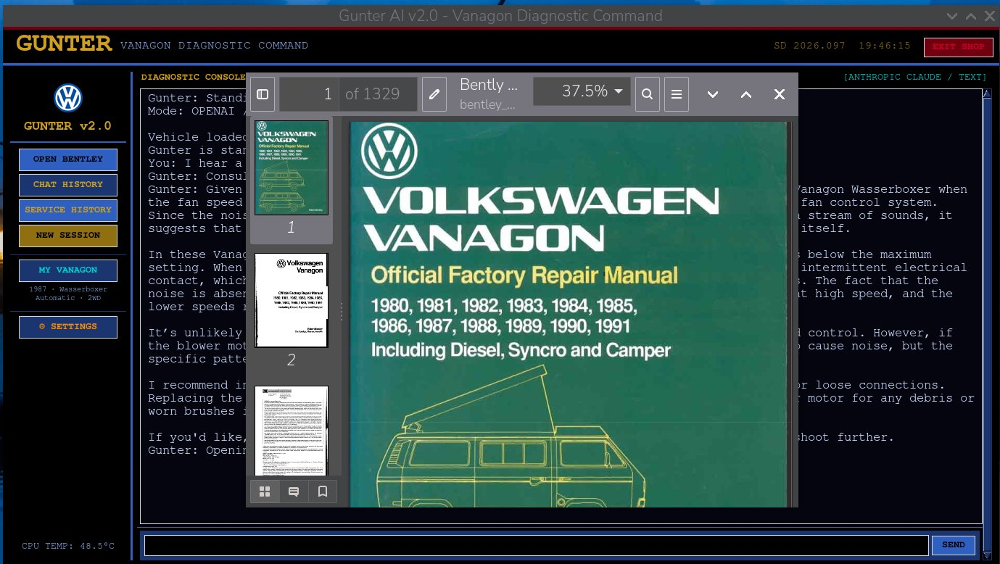

# 🔧 Gunter AI — Vanagon Diagnostic Command v2.0

> *"Ja, I know every bolt on this Vana-gon. Ask me anything."*

Gunter is an AI-powered diagnostic assistant for 1980–1991 Volkswagen Vanagons. He runs on a Raspberry Pi, any Linux machine, or macOS, speaks with a German mechanic's authority, and has read every page of the Bentley Manual so you don't have to.

Built with Python, LangChain, ChromaDB, Piper TTS, and your choice of AI provider.

---

## 📸 Screenshots

### Main Interface

*Gunter answering a diagnostic question using OpenAI — LCARS-inspired interface with live provider indicator*

### Voice Selection

*19 Piper TTS voices with live TEST VOICE preview — no restart required*

### API Providers

*Multi-provider support — Anthropic Claude, OpenAI, Groq, and OpenRouter with live model fetching*

### Vehicle Configuration

*Per-user vehicle configuration — year, engine, transmission, and drivetrain stored between sessions*

### Service History

*Full service history tracking with mileage — Gunter proactively flags overdue maintenance*

### Bentley Manual Integration

*Gunter opens the Bentley Manual directly to the relevant page when answering technical questions*

---

## ✨ Features

- **RAG-powered knowledge base** — 891MB vectorstore built from the Bentley Manual, Digifant Training Manual, and 1,046 TheSamba forum threads
- **Multi-provider AI support** — Anthropic Claude, OpenAI, Groq, OpenRouter, or local Ollama (fully offline)
- **Live model selection** — Fetch current model lists directly from each provider's API
- **19 Piper TTS voices** — Amy, Joe, Ryan, and 16 L2Arctic speakers with in-app preview
- **Voice wake word** — "Hey Gunter" via Picovoice (optional)
- **Service history tracking** — Log maintenance with mileage, get proactive reminders
- **Vehicle configuration** — Year, engine type, transmission, and drivetrain stored per user
- **Bentley Manual integration** — Opens directly to the relevant page for technical questions
- **LCARS-inspired UI** — Touchscreen-friendly, runs beautifully on an 800×480 display
- **Fully offline capable** — Works without internet using Ollama + local Whisper STT
- **macOS native support** — Dedicated `mechanic_macos.py` with native audio, PDF viewer, and corrected button rendering

---

## 🖥️ Platform Support

| Platform | Script | Status |
|---|---|---|
| Raspberry Pi 5 (8GB+) | `Mechanic.py` | ✅ Primary target |
| Linux x86_64 | `Mechanic.py` | ✅ Fully supported |
| macOS (Apple Silicon) | `mechanic_macos.py` | ✅ Fully supported |
| 800×480 touchscreen | `Mechanic.py` | ✅ Kiosk mode |
| Windows | — | Not yet supported |

---

## 🚀 Quick Start

### 1. Clone the repo
```bash
git clone https://github.com/yourusername/GunterAI.git
cd GunterAI
```

### 2. Create a virtual environment

**Linux / Raspberry Pi:**
```bash
python3 -m venv .venv
source .venv/bin/activate
pip install -r requirements.txt
```

**macOS (Apple Silicon):**
```bash
chmod +x setup_venv_macos.sh
./setup_venv_macos.sh
source gunter_venv/bin/activate
```

> **macOS note:** Requires Homebrew Python with Tk support:
> ```bash
> brew install python-tk@3.x   # match your Python version
> ```
> Piper TTS is installed automatically via `pip install piper-tts` — no separate binary download needed on macOS.

### 3. Configure your environment
```bash
cp sample.env .env
nano .env   # set WAKE_MODE and LLM_MODE at minimum
```

### 4. Set up your AI provider
You have two options:

**Option A — Use the Settings panel (recommended)**
Launch Gunter, click **⚙ SETTINGS → API PROVIDERS**, paste your key, click FETCH MODELS, choose a model, and SET ACTIVE.

**Option B — Legacy .env**
Set `LLM_MODE=claude` and add your `ANTHROPIC_API_KEY` to `.env`.

### 5. Download the Gunter vectorstore
The vectorstore is the heart of Gunter — 891MB of knowledge built from the Bentley Manual, Digifant Training Manual, and 1,046 TheSamba forum threads. It is pre-built so you don't have to do anything except download and unzip it.

**[⬇ Download vanagon_local_db.zip from Google Drive](https://drive.google.com/file/d/1vXA06zAspyTYwAuYcgww67Pa88hhd4PA/view?usp=drive_link)**

Once downloaded, unzip it into your project folder:
```bash
unzip vanagon_local_db.zip
```
Your folder should then contain a `vanagon_local_db/` directory alongside `Mechanic.py`. That's it — no ingestion or scraping required.

> 💡 Advanced users who want to rebuild or expand the vectorstore can use `tools/ingest.py` and `tools/samba_scrape.py`. See those files for instructions.

### 6. Download the OCR Manuals (optional)
The OCR-processed Bentley and Digifant manuals are available for download. These are required only if you want to rebuild the vectorstore yourself.

**[⬇ Download Vanagon OCR Manuals from Google Drive](https://drive.google.com/file/d/16NKdL0RKErklSyWmMrW0K_CUy7Y9TuoZ/view?usp=drive_link)**

Unzip into the `Manuals/` folder in your project directory.

### 7. Launch Gunter

**Linux / Raspberry Pi:**
```bash
python3 Mechanic.py
# or
bash launch_gunter.sh
```

**macOS:**
```bash
source gunter_venv/bin/activate
python3 mechanic_macos.py
```

---

## 🤖 AI Providers

Gunter supports four cloud providers plus local Ollama. Configure them in **Settings → API Providers** — no `.env` editing required.

| Provider | Best Model for Gunter | Free Tier | Notes |
|---|---|---|---|
| **Anthropic Claude** | claude-haiku-4-5-20251001 | No | Best system prompt adherence |
| **OpenAI** | gpt-4.1-nano / gpt-4o-mini | No | Fast, widely supported |
| **Groq** | llama3-8b-8192 | Yes ✓ | Very fast, great free option |
| **OpenRouter** | mistral-7b-instruct | Yes ✓ | Routes to 300+ models |
| **Ollama** (local) | mistral:7b | Free ✓ | Fully offline, no API key |

> **Note:** Cloud providers dramatically outperform local models for Gunter's use case. The RAG context, wiki injection, service history, and system prompt together require significant context capacity. Anthropic Claude and OpenAI GPT-4o-mini consistently produce the most accurate, citation-rich responses. Ollama is recommended as an offline fallback. If using Ollama, **mistral:7b** produces the best results among tested local models.

---

## 🎙️ Wake Modes

Set `WAKE_MODE` in your `.env`:

| Mode | Description |
|---|---|
| `text` | Type questions, press SEND or Enter. No microphone needed. *(recommended for macOS)* |
| `manual` | Press the LISTEN button, then speak. Offline-capable. |
| `picovoice` | Say *"Hey Gunter"* — hands-free wake word. Requires Picovoice API key. |

> **macOS note:** Picovoice wake word requires the macOS `.ppn` model file — the Raspberry Pi `.ppn` file is not compatible.

---

## 🗣️ Voices

Gunter ships with 19 Piper TTS voices selectable from the Settings panel:

- **Amy** (Medium) — Clear American female
- **Joe** (Medium) — American male
- **Ryan** (High quality) — American male, highest fidelity
- **L2Arctic Speakers 0–15** — Diverse accent set

Select and preview voices in **⚙ Settings → Voice** without restarting.

> **macOS note:** Piper TTS is installed via `pip install piper-tts`. The standalone binary download from the Piper releases page is not compatible with macOS — use the pip package instead.

---

## 📁 Project Structure

```
GunterAI/
├── Mechanic.py            # Main application — Linux / Raspberry Pi
├── mechanic_macos.py      # macOS port — Apple Silicon native
├── launch_gunter.sh       # Startup script (Linux)
├── setup_venv_macos.sh    # One-shot venv setup for macOS
├── requirements.txt       # Python dependencies (Linux)
├── sample.env             # Environment template — copy to .env
├── CLAUDE.md              # Claude Code context file
├── LICENSE.txt
├── README.md
├── piper/                 # Piper TTS binary and data (Linux)
├── voices/                # Piper voice models (.onnx)
├── wake_word/             # Picovoice wake word model (.ppn)
├── tools/
│   ├── ingest.py          # Build/rebuild the vectorstore
│   └── samba_scrape.py    # Scrape TheSamba forum threads
├── Manuals/               # PDF manuals — download separately (see above)
├── vanagon_local_db/      # ChromaDB vectorstore — download separately
└── vanagon_wiki/          # Verified Vanagon reference pages (Markdown)
```

---

## 🔧 CrowPi / Touchscreen Deployment

For an 800×480 touchscreen (e.g. CrowPi), change these lines in `Mechanic.py`:

```python
BASE_PATH  = "/home/pi/GunterAI"   # adjust to your path
self.geometry("800x480")
self.resizable(False, False)
# Uncomment kiosk lines:
self.attributes("-fullscreen", True)
self.lift()
self.attributes("-topmost", True)
self.focus_force()
```

---

## 🍎 macOS-Specific Notes

`mechanic_macos.py` is a dedicated macOS port with the following differences from `Mechanic.py`:

| Feature | Linux (`Mechanic.py`) | macOS (`mechanic_macos.py`) |
|---|---|---|
| Audio playback | `paplay` | `afplay` (built-in) |
| Piper TTS binary | `piper/piper` (ELF) | `gunter_venv/bin/piper` (pip) |
| PDF viewer | `evince` | `open` + Preview |
| CPU temperature | `/sys/class/thermal/` | `osx-cpu-temp` or `smctemp` |
| Button rendering | `tk.Button` | `ttk.Button` + custom `LCARS` style |
| Popup windows | Standard | `lift()`/`focus_force()` z-order fix |
| Default wake mode | `picovoice` | `text` |
| Window size | `1024×600` | `1100×700` (resizable) |

---

## 📦 Requirements

Key dependencies (see `requirements.txt` for full list):

```
anthropic
langchain-chroma
langchain-ollama
faster-whisper
pvporcupine
pvrecorder
pyaudio
pillow
python-dotenv
requests
```

---

## 🙏 Acknowledgements

- [Piper TTS](https://github.com/rhasspy/piper) — fast, local neural text-to-speech
- [Faster Whisper](https://github.com/SYSTRAN/faster-whisper) — efficient speech recognition
- [Picovoice](https://picovoice.ai/) — "Hey Gunter" wake word detection
- [TheSamba.com](https://www.thesamba.com/) — the Vanagon community that keeps these vans alive
- The VW Vanagon community — for 40+ years of keeping these vans rolling

---

## 📄 License

See `LICENSE.txt` for details.

---

*Built with ❤️ for the Vanagon community. Gute Fahrt!* 🚐
